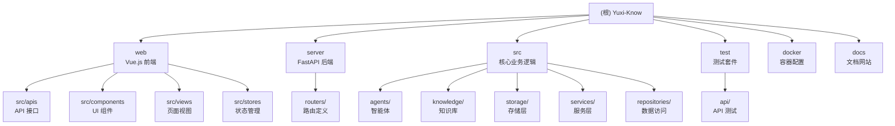
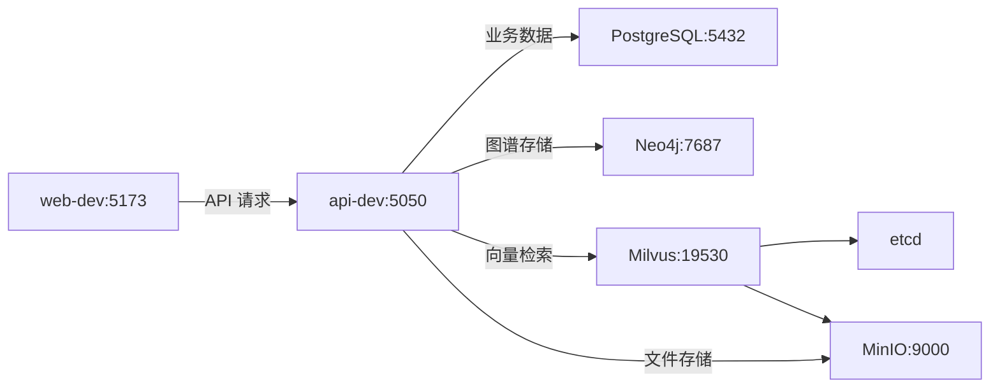

# 项目目录结构 (Project Overview)

Yuxi-Know 是一个基于大模型的智能知识库与知识图谱智能体开发平台，融合了 RAG 技术与知识图谱技术，基于 LangGraph v1 + Vue.js + FastAPI + LightRAG 架构构建。项目完全通过 Docker Compose 进行管理，支持热重载开发。

## 变更记录 (Changelog)

### 2026-02-05
- 初始化项目 AI 上下文文档
- 生成模块结构图和模块索引
- 创建 `.claude/index.json` 索引文件，扫描覆盖率 99.3%

---

## 项目愿景

构建一个面向真实业务的智能体开发平台，让开发者能够：
- 轻松构建 RAG + 知识图谱智能体
- 将各种格式文档快速转化为可推理的知识库
- 使用 LangGraph v1 构建多智能体/子智能体系统
- 在统一平台中完成开发、测试、部署全流程

---

## 架构总览

### 技术栈

- **后端**: FastAPI + Python 3.12+ + LangGraph v1
- **前端**: Vue 3 + Vite + Ant Design Vue + Pinia
- **数据库**: PostgreSQL (业务数据) + Neo4j (知识图谱) + Milvus (向量数据库)
- **存储**: MinIO (文件存储)
- **编排**: Docker Compose
- **包管理**: uv (Python) + pnpm (Node)

### 模块结构图



### 服务依赖关系



---

## 模块索引

| 模块 | 路径 | 语言 | 职责 | 入口文件 | 是否有测试 |
|-----|------|------|------|---------|-----------|
| **web** | `web/` | Vue.js/JavaScript | 用户界面和交互 | `web/src/main.js` | 否 |
| **server** | `server/` | Python | FastAPI API 服务 | `server/main.py` | 是 |
| **src** | `src/` | Python | 核心业务逻辑 | N/A (包目录) | 是 |
| **test** | `test/` | Python | 测试套件 | `test/conftest.py` | 是 (自包含) |
| **docs** | `docs/` | Markdown | VitePress 文档站点 | `docs/.vitepress/config.mts` | 否 |

### 模块职责详情

#### web (前端模块)
- Vue 3 + Vite 构建的单页应用
- 使用 Ant Design Vue 组件库
- 提供智能体对话、知识库管理、图谱可视化等界面
- 状态管理基于 Pinia，路由基于 Vue Router

#### server (后端模块)
- FastAPI 提供 RESTful API
- 包含路由注册、中间件配置、身份验证
- 热重载开发模式（`--reload`）

#### src (核心模块)
- **agents**: 智能体实现，基于 LangGraph v1
- **knowledge**: 知识库管理（RAG + 知识图谱）
- **storage**: 数据库访问层（PostgreSQL/Neo4j/Milvus/MinIO）
- **services**: 业务服务层（聊天、评估、MCP 等）
- **repositories**: 数据访问封装
- **models**: 数据模型定义
- **plugins**: 文档解析插件

#### test (测试模块)
- pytest 测试框架
- API 路由测试、集成测试、单元测试
- 使用 aiohttp/httpx 进行异步测试

---

## 运行与开发

### 快速启动

```bash
# 1. 首次运行，初始化环境
./scripts/init.sh  # Linux/macOS
# 或
.\scripts\init.ps1  # Windows PowerShell

# 2. 启动所有服务
docker compose up -d

# 3. 查看日志
docker logs api-dev --tail 100
docker logs web-dev --tail 100
```

### 访问地址

- 前端: http://localhost:5173
- 后端 API: http://localhost:5050
- Neo4j Browser: http://localhost:7474
- MinIO Console: http://localhost:9001

### 常用开发命令

```bash
# 启动/停止
make start     # docker compose up -d
make stop      # docker compose down

# 代码检查和格式化
make lint      # ruff check + format --check
make format    # ruff format + fix

# 运行测试
make router-tests  # 运行 API 路由测试

# 直接在容器内执行
docker compose exec api uv run python test/your_script.py
```

---

## 开发准则 (Development Guidelines)

### 核心原则

1. **避免过度工程化** (Avoid Over-engineering)
   - 只做被明确请求或清晰必要的修改
   - 不要添加额外特性、重构或"改进"
   - 用最少的复杂度解决当前问题

2. **信任框架保证**
   - 不要为不可能发生的场景添加错误处理、回退或验证
   - 只在系统边界（用户输入、外部 API）进行验证

3. **DRY 原则**
   - 不要为一次性操作创建助手、工具或抽象
   - 不要为假设的未来需求设计
   - 复用现有抽象

### 前端开发规范

- **API 接口**: 所有 API 接口定义在 `web/src/apis/` 下
- **图标**: 从 `@ant-design/icons-vue` 或 `lucide-vue-next` (推荐，注意尺寸)
- **样式**: 使用 Less，优先引用 `web/src/assets/css/base.css` 中的颜色变量
- **UI 风格**: 简洁一致，无悬停位移，避免过度使用阴影和渐变
- **格式化**: 开发完成后在 `web` 目录运行 `npm run format`

### 后端开发规范

- **Python 版本**: Python 3.12+，使用 Pythonic 风格
- **代码格式**:
  ```bash
  make lint    # 检查规范
  make format  # 格式化代码
  ```
- **调试接口**: 使用环境变量 `YUXI_SUPER_ADMIN_NAME` / `YUXI_SUPER_ADMIN_PASSWORD`
- **文档更新**: 代码更新后检查 `docs/latest` 是否需要更新

---

## 测试策略

### 测试组织

- **pytest**: 主测试框架，支持异步测试
- **test/api/**: API 路由测试
- **test/**: 集成测试、单元测试、并发测试等

### 运行测试

```bash
# 运行所有 API 测试
make router-tests

# 运行特定测试
docker compose exec api uv run pytest test/api/test_knowledge_router.py

# 查看覆盖率
docker compose exec api uv run pytest --cov=src test/
```

---

## 编码规范

### Python 规范

- **行宽**: 120 字符
- **工具**: Ruff (lint + format)
- **配置文件**: `pyproject.toml`
- **导入顺序**: 严格遵循 Ruff I 规则

### JavaScript/TypeScript 规范

- **工具**: ESLint + Prettier
- **配置文件**: `web/eslint.config.js`

---

## AI 使用指引

### 调试环境变量

```bash
YUXI_SUPER_ADMIN_NAME=admin
YUXI_SUPER_ADMIN_PASSWORD=admin123
```

### 关键配置文件

- `.env`: 环境变量配置（从 `.env.template` 复制）
- `docker-compose.yml`: 服务编排定义
- `pyproject.toml`: Python 依赖和配置
- `web/package.json`: Node 依赖

### 日志查看

```bash
# 查看所有服务日志
docker compose logs -f

# 查看特定服务日志
docker logs api-dev --tail 100 --follow
docker logs web-dev --tail 100 --follow
```

### 热重载说明

`api-dev` 和 `web-dev` 服务均配置了热重载：
- **前端**: 修改 `web/src/` 下的文件后，Vite 自动刷新浏览器
- **后端**: 修改 `src/` 或 `server/` 下的文件后，Uvicorn 自动重载

### 文档规范

- 开发者文档保存在 `docs/vibe/`（仅开发者可见，非必要不创建）
- 用户文档在 `docs/latest/`，更新后需考虑版本兼容性
- 文档目录在 `docs/.vitepress/config.mts` 中定义

---

## 数据库架构

### PostgreSQL (业务数据)

- **用户管理**: User, Department
- **对话管理**: Conversation, Message, MessageFeedback, ConversationStats
- **智能体**: AgentConfig
- **知识库**: KnowledgeDatabase, KnowledgeFile, KnowledgeChunk
- **系统**: OperationLog, MCPServer, EvaluationRecord

### Neo4j (知识图谱)

- 用于存储和管理知识图谱数据
- 通过 LightRAG 进行图构建和查询

### Milvus (向量数据库)

- 存储文档 Embedding 向量
- 用于 RAG 检索

---

## 重要提示

1. **所有开发都在 Docker 容器环境中进行**
   - 不要在本地直接运行 Python 或 Node
   - 使用 `docker compose exec` 进入容器执行命令

2. **热重载是默认行为**
   - 修改代码后无需重启容器
   - 如遇问题，先查看日志再重启

3. **代码提交前务必格式化**
   - Python: `make format`
   - JavaScript: `web/npm run format`

4. **敏感信息不要提交**
   - `.env` 文件不在版本控制中
   - 使用 `.env.template` 作为模板

5. **文档与代码同步更新**
   - 新增功能或修改 API 后更新文档

---

## 相关资源

- [项目 README](./README.md)
- [AGENTS.md](./AGENTS.md) - 智能体详细说明
- [文档网站](https://xerrors.github.io/Yuxi-Know/)
- [GitHub Issues](https://github.com/xerrors/Yuxi-Know/issues)
