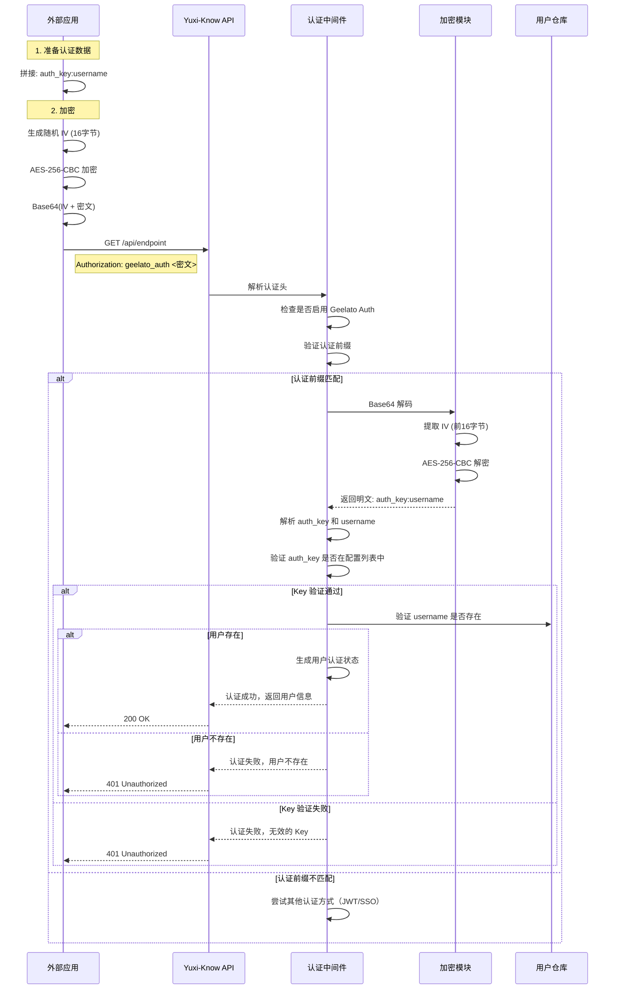

# Geelato Auth 认证方式

## 概述

Geelato Auth 是一种基于对称加密的认证方式，适用于外部应用与 Yuxi-Know 系统的集成。通过预共享的加密密钥和认证 Key，外部应用可以安全地调用 Yuxi-Know 的 API 接口。

## 认证流程



## 配置说明

### 环境变量配置

在 `.env` 文件中添加以下配置：

```env
# ============================ Geelato Auth 配置 ============================
# Geelato Auth 开关
GEELATO_AUTH_ENABLED=true

# Geelato Auth 前缀（默认: geelato_auth）
GEELATO_AUTH_PREFIX=geelato_auth

# Geelato Auth 加密密钥（32字节，Base64编码）
# 生成方式: python -c "import base64, os; print(base64.b64encode(os.urandom(32)).decode())"
GEELATO_AUTH_SECRET_KEY=your-base64-encoded-secret-key

# Geelato Auth Key 列表（逗号分隔，支持多个）
GEELATO_AUTH_KEYS=f47ac10b-58cc-4372-a567-0e02b2c3d479,0b1c2d3e-4f5a-6b7c-8d9e-0f1a2b3c4d5e

# Geelato Auth 是否要求用户必须存在（默认: true）
GEELATO_AUTH_REQUIRE_USER_EXIST=true
```

### 配置项说明

| 配置项 | 类型 | 默认值 | 说明 |
|--------|------|--------|------|
| `GEELATO_AUTH_ENABLED` | boolean | `false` | 是否启用 Geelato Auth 认证方式 |
| `GEELATO_AUTH_PREFIX` | string | `geelato_auth` | 认证 header 前缀 |
| `GEELATO_AUTH_SECRET_KEY` | string | 无 | 加密密钥（32字节，Base64编码） |
| `GEELATO_AUTH_KEYS` | string | 无 | 认证 Key 列表，逗号分隔 |
| `GEELATO_AUTH_REQUIRE_USER_EXIST` | boolean | `true` | 是否要求用户必须存在 |

### 生成加密密钥

```bash
# Python 方式
python -c "import base64, os; print(base64.b64encode(os.urandom(32)).decode())"

# OpenSSL 方式
openssl rand -base64 32
```

## 加密方案

### 加密算法

- **算法**：AES-256-CBC（对称加密）
- **密钥长度**：32 字节（256 位）
- **IV（初始化向量）**：16 字节，随机生成
- **编码格式**：Base64

### 加密数据格式

```
原始数据: <auth_key>:<username>
加密后数据: Base64(IV + AES加密数据)
```

### 认证头格式

```
Authorization: geelato_auth <加密后的认证信息>
```

## 使用示例

### Python 调用示例

```python
import base64
import os
import requests
from cryptography.hazmat.primitives.ciphers import Cipher, algorithms, modes
from cryptography.hazmat.backends import default_backend

class GeelatoAuthClient:
    def __init__(self, secret_key_b64: str):
        self.secret_key_b64 = secret_key_b64
        self.key = base64.b64decode(secret_key_b64)
    
    def encrypt(self, plaintext: str) -> str:
        """加密认证数据"""
        iv = os.urandom(16)
        plaintext_bytes = plaintext.encode('utf-8')
        
        # PKCS7 填充
        padding_len = 16 - len(plaintext_bytes) % 16
        padded_data = plaintext_bytes + bytes([padding_len] * padding_len)
        
        # AES-CBC 加密
        cipher = Cipher(algorithms.AES(self.key), modes.CBC(iv), backend=default_backend())
        encryptor = cipher.encryptor()
        ciphertext = encryptor.update(padded_data) + encryptor.finalize()
        
        return base64.b64encode(iv + ciphertext).decode('utf-8')
    
    def call_api(self, base_url: str, endpoint: str, auth_key: str, username: str, **kwargs):
        """调用 API"""
        # 加密认证数据
        auth_data = f"{auth_key}:{username}"
        encrypted = self.encrypt(auth_data)
        
        # 发送请求
        headers = kwargs.pop('headers', {})
        headers['Authorization'] = f'geelato_auth {encrypted}'
        
        return requests.get(f"{base_url}{endpoint}", headers=headers, **kwargs)

# 使用示例
client = GeelatoAuthClient("your-base64-encoded-secret-key")
response = client.call_api(
    base_url="http://localhost:5050",
    endpoint="/api/chat/agent",
    auth_key="f47ac10b-58cc-4372-a567-0e02b2c3d479",
    username="admin"
)
print(response.json())
```

### Java 调用示例

```java
import javax.crypto.Cipher;
import javax.crypto.spec.IvParameterSpec;
import javax.crypto.spec.SecretKeySpec;
import java.nio.charset.StandardCharsets;
import java.util.Base64;
import java.net.http.HttpClient;
import java.net.http.HttpRequest;
import java.net.http.HttpResponse;
import java.net.URI;

public class GeelatoAuthClient {
    private final byte[] secretKey;
    
    public GeelatoAuthClient(String secretKeyBase64) {
        this.secretKey = Base64.getDecoder().decode(secretKeyBase64);
    }
    
    public String encrypt(String plaintext) throws Exception {
        byte[] iv = new byte[16];
        new java.security.SecureRandom().nextBytes(iv);
        
        Cipher cipher = Cipher.getInstance("AES/CBC/PKCS5Padding");
        SecretKeySpec keySpec = new SecretKeySpec(secretKey, "AES");
        IvParameterSpec ivSpec = new IvParameterSpec(iv);
        cipher.init(Cipher.ENCRYPT_MODE, keySpec, ivSpec);
        
        byte[] encrypted = cipher.doFinal(plaintext.getBytes(StandardCharsets.UTF_8));
        byte[] combined = new byte[iv.length + encrypted.length];
        System.arraycopy(iv, 0, combined, 0, iv.length);
        System.arraycopy(encrypted, 0, combined, iv.length, encrypted.length);
        
        return Base64.getEncoder().encodeToString(combined);
    }
    
    public String callApi(String baseUrl, String endpoint, String authKey, String username) throws Exception {
        String authData = authKey + ":" + username;
        String encrypted = encrypt(authData);
        
        HttpClient client = HttpClient.newHttpClient();
        HttpRequest request = HttpRequest.newBuilder()
            .uri(URI.create(baseUrl + endpoint))
            .header("Authorization", "geelato_auth " + encrypted)
            .GET()
            .build();
        
        HttpResponse<String> response = client.send(request, HttpResponse.BodyHandlers.ofString());
        return response.body();
    }
}
```

### cURL 调用示例

需要先使用脚本生成加密数据：

```bash
# 使用 Python 生成加密数据
ENCRYPTED=$(python3 -c "
import base64, os
from cryptography.hazmat.primitives.ciphers import Cipher, algorithms, modes
from cryptography.hazmat.backends import default_backend

secret_key = base64.b64decode('your-base64-secret-key')
plaintext = 'f47ac10b-58cc-4372-a567-0e02b2c3d479:admin'
iv = os.urandom(16)
plaintext_bytes = plaintext.encode('utf-8')
padding_len = 16 - len(plaintext_bytes) % 16
padded_data = plaintext_bytes + bytes([padding_len] * padding_len)
cipher = Cipher(algorithms.AES(secret_key), modes.CBC(iv), backend=default_backend())
encryptor = cipher.encryptor()
ciphertext = encryptor.update(padded_data) + encryptor.finalize()
print(base64.b64encode(iv + ciphertext).decode())
")

# 使用加密数据调用 API
curl -H "Authorization: geelato_auth $ENCRYPTED" \
  http://localhost:5050/api/chat/agent
```

## 安全注意事项

### 安全措施

1. **传输加密**：认证信息使用 AES-256-CBC 加密，避免明文传输
2. **随机 IV**：每次加密使用随机 IV，防止密文分析攻击
3. **密钥保护**：加密密钥存储在环境变量中，不提交到版本控制
4. **认证 Key 验证**：双重验证（加密密钥 + 认证 Key）
5. **权限控制**：复用现有的用户权限系统

### 安全最佳实践

- 使用强随机生成的加密密钥（32 字节）
- 定期轮换加密密钥和认证 Key
- 生产环境禁用调试日志
- 使用 HTTPS 传输
- 分发密钥时使用安全通道

### 风险评估

| 风险 | 影响 | 缓解措施 |
|------|------|----------|
| 加密密钥泄露 | 认证信息可被解密 | 密钥定期轮换，使用密钥管理服务 |
| 重放攻击 | 认证信息可被重用 | 添加时间戳验证（可选增强） |
| 传输窃听 | 加密数据被截获 | 使用 HTTPS 传输 |
| 暴力破解 | 密钥被猜测 | 使用足够长度的随机密钥 |

## 错误处理

| 错误码 | 说明 | 解决方案 |
|--------|------|----------|
| 401 | 认证数据解密失败 | 检查加密密钥是否正确 |
| 401 | 无效的 Geelato Auth Key | 检查 auth_key 是否在配置列表中 |
| 401 | 用户不存在 | 确保用户名在系统中存在 |
| 401 | SSO 未启用 | 确保 GEELATO_AUTH_ENABLED=true |

## 可选增强：时间戳验证

为防止重放攻击，可在认证数据中添加时间戳：

```
原始数据: <auth_key>:<username>:<timestamp>
```

后端验证时检查时间戳是否在有效范围内（如 5 分钟）。

## 与其他认证方式的对比

| 认证方式 | 适用场景 | 安全级别 | 实现复杂度 |
|---------|---------|---------|-----------|
| 本地 JWT | 前端用户登录 | 高 | 低 |
| SSO Token | 企业统一认证 | 高 | 中 |
| Geelato Auth | 后端服务集成 | 中 | 中 |

## 常见问题

### Q: 如何生成新的加密密钥？

```bash
python -c "import base64, os; print(base64.b64encode(os.urandom(32)).decode())"
```

### Q: 如何添加新的认证 Key？

在 `.env` 文件中的 `GEELATO_AUTH_KEYS` 配置项添加新的 Key，用逗号分隔：

```env
GEELATO_AUTH_KEYS=key1,key2,key3
```

### Q: 认证 Key 和加密密钥有什么区别？

- **加密密钥**：用于加密/解密认证数据，只有服务端和调用方知道
- **认证 Key**：用于标识调用方身份，可以有多个，配置在服务端

### Q: 如何实现多租户？

可以为不同的租户分配不同的认证 Key，在代码中根据 auth_key 识别租户身份。
