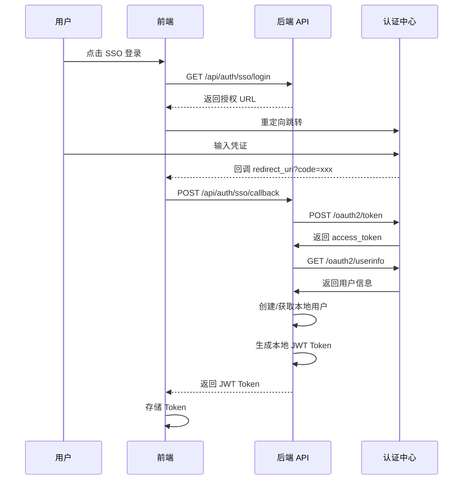

# 单点登录 (SSO) 集成方案

## 概述

本文档描述 Yuxi-Know 项目集成 OAuth2 单点登录 (SSO) 的完整方案。方案采用**双模式 Token 认证**，保留现有本地登录功能的同时支持统一认证中心登录。

## 集成模式

### 模式选择

采用集成文档中的**模式二：统一认证中心集成 (基于 OAuth2)**

### 核心设计

SSO 登录后自动生成本地 JWT Token，业务层统一使用本地 JWT 进行认证，无需改造现有业务中间件。



## 技术架构

### Token 模式区分

| Token 前缀 | 认证方式 | 用途 |
|-----------|---------|------|
| `JWTBearer ` | 本地 JWT | 本地密码登录、SSO 登录后生成的 Token |
| `Bearer ` | OAuth2 | 直接携带 SSO Token（可选，本方案主要使用 JWTBearer 模式） |

### 认证流程

```
┌─────────────────────────────────────────────────────────────┐
│                        认证入口                               │
└─────────────────────────────────────────────────────────────┘
                              │
                ┌─────────────┴─────────────┐
                │                           │
         本地登录 (/api/auth/token)   SSO 登录 (/api/auth/sso/login)
                │                           │
        验证用户名密码              跳转认证中心获取授权码
                │                           │
        生成本地 JWT Token     授权码换 Token → 读取用户信息 → 创建/获取本地用户 → 生成本地 JWT Token
                │                           │
                └─────────────┬─────────────┘
                              │
                    ┌─────────▼─────────┐
                    │   统一 JWT Token   │
                    └─────────┬─────────┘
                              │
              ┌───────────────┴───────────────┐
              │      业务请求携带 JWT Token     │
              └───────────────┬───────────────┘
                              │
                    ┌─────────▼─────────┐
                    │   本地 JWT 验证    │
                    └─────────┬─────────┘
                              │
                    ┌─────────▼─────────┐
                    │  返回用户信息       │
                    └───────────────────┘
```

## 环境变量配置

在 `.env` 文件中添加以下配置：

```env
# SSO 开关
SSO_ENABLED=false

# OAuth2 端点配置
SSO_AUTHORIZATION_URL=https://auth.example.com/oauth2/authorize
SSO_TOKEN_URL=https://auth.example.com/oauth2/token
SSO_USER_INFO_URL=https://auth.example.com/oauth2/userinfo
SSO_INTROSPECT_URL=https://auth.example.com/oauth2/introspect

# 客户端凭证
SSO_CLIENT_ID=yuxi-know
SSO_CLIENT_SECRET=your-secret-here
SSO_REDIRECT_URI=http://localhost:5173/sso/callback

# 授权范围
SSO_SCOPE=openid profile email

# 用户字段映射配置
SSO_FIELD_MAPPING_USERNAME=username
SSO_FIELD_MAPPING_USERID=sub
SSO_FIELD_MAPPING_PHONE=phone_number
SSO_FIELD_MAPPING_AVATAR=picture
SSO_FIELD_MAPPING_EMAIL=email
```

## 数据库变更

### User 模型新增字段

```sql
ALTER TABLE users ADD COLUMN user_id_sso VARCHAR(100);
ALTER TABLE users ADD COLUMN login_source VARCHAR(20) DEFAULT 'local';
CREATE INDEX idx_user_id_sso ON users(user_id_sso);
```

### 字段说明

| 字段 | 类型 | 说明 |
|------|------|------|
| `user_id_sso` | VARCHAR(100) | SSO 用户的唯一标识（如 sub） |
| `login_source` | VARCHAR(20) | 登录来源：local/sso/both |

## API 接口

### 1. 检查 SSO 是否启用

```http
GET /api/auth/sso/enabled
```

**响应**：
```json
{
  "enabled": true
}
```

### 2. 获取 SSO 授权 URL

```http
GET /api/auth/sso/login
```

**响应**：
```json
{
  "authorization_url": "https://auth.example.com/oauth2/authorize?response_type=code&client_id=xxx&redirect_uri=xxx&state=xxx",
  "state": "abc123..."
}
```

### 3. SSO 回调处理

```http
POST /api/auth/sso/callback
Content-Type: application/json

{
  "code": "authorization_code_from_callback",
  "state": "state_from_login"
}
```

**响应**：
```json
{
  "access_token": "eyJhbGciOiJIUzI1NiIs...",
  "token_type": "bearer",
  "user_id": 1,
  "username": "张三",
  "user_id_login": "zhangsan",
  "phone_number": "13800000000",
  "avatar": "https://example.com/avatar.jpg",
  "role": "user",
  "department_id": 1,
  "department_name": "技术部"
}
```

## 登录流程

### 本地登录流程（现有）

```
用户输入用户名密码 → POST /api/auth/token → 验证密码 → 返回 JWT Token
```

### SSO 登录流程

```
用户点击 SSO 登录 → GET /api/auth/sso/login → 跳转认证中心
→ 用户认证 → 回调前端 /sso/callback?code=xxx → POST /api/auth/sso/callback
→ 授权码换 Token → 获取用户信息 → 创建/获取本地用户 → 返回 JWT Token
```

## 用户创建策略

### 新用户处理

SSO 用户首次登录时：
1. 根据 `user_id_sso` 查询本地用户
2. 不存在则创建新用户
3. 根据字段映射提取用户信息填充
4. 默认角色为 `user`
5. 自动分配默认部门

### 已存在用户处理

1. 根据 `user_id_sso` 匹配已有用户
2. 更新用户头像、手机号等可变信息
3. 更新 `last_login` 时间

## 前端集成

### 1. 登录页修改

在登录页面底部添加 SSO 登录按钮，点击时：

```javascript
// 获取授权 URL
const { data } = await getSSOLoginUrl()
// 保存 state 防止 CSRF
sessionStorage.setItem('sso_state', data.state)
// 跳转到认证中心
window.location.href = data.authorization_url
```

### 2. 回调页面

创建 `/sso/callback` 页面，从 URL 参数提取 `code` 和 `state`：

```javascript
const code = route.query.code
const state = route.query.state
const savedState = sessionStorage.getItem('sso_state')

// 验证 state
if (state !== savedState) {
  // CSRF 攻击，拒绝
  return
}

// 调用回调 API
const res = await ssoCallback({ code, state })

// 存储 Token
userStore.setToken(res.data.access_token)
userStore.setUserInfo(res.data)

// 跳转首页
router.push('/')
```

### 3. 路由配置

```javascript
{
  path: '/sso/callback',
  name: 'SSOCallback',
  component: () => import('@/views/auth/SSOCallback.vue'),
  meta: { requiresAuth: false }
}
```

## 安全考虑

### 1. CSRF 防护

- 使用 `state` 参数防止 CSRF 攻击
- 前端生成随机 state 存储在 sessionStorage
- 回调时验证 state 一致性

### 2. Token 验证

- SSO Token 使用 introspect 端点验证有效性
- 本地 JWT 使用密钥签名验证
- Token 过期后需重新登录

### 3. HTTPS

生产环境必须使用 HTTPS 传输敏感信息

### 4. 密钥保护

- `SSO_CLIENT_SECRET` 存储在环境变量中
- 不提交到版本控制

## 文件变更清单

### 后端文件

| 文件 | 操作 | 说明 |
|------|------|------|
| `.env.template` | 修改 | 新增 SSO 配置项 |
| `server/utils/oauth2_client.py` | 新建 | OAuth2 客户端封装 |
| `server/utils/auth_utils.py` | 修改 | 新增 Token 解析方法 |
| `server/utils/auth_middleware.py` | 修改 | 支持双 Token 模式 |
| `server/routers/sso_router.py` | 新建 | SSO 路由实现 |
| `src/storage/postgres/models_business.py` | 修改 | 新增 SSO 相关字段 |
| `server/routers/__init__.py` | 修改 | 注册 SSO 路由 |

### 前端文件

| 文件 | 操作 | 说明 |
|------|------|------|
| `web/src/apis/auth.js` | 修改 | 新增 SSO API 调用 |
| `web/src/views/login/Login.vue` | 修改 | 添加 SSO 登录按钮 |
| `web/src/views/auth/SSOCallback.vue` | 新建 | SSO 回调页面 |
| `web/src/router/index.js` | 修改 | 新增回调路由 |

## 部署步骤

1. 配置认证中心回调白名单（添加 `SSO_REDIRECT_URI`）
2. 修改 `.env` 文件，配置 SSO 相关参数
3. 执行数据库迁移脚本
4. 重新构建并启动服务
5. 测试 SSO 登录流程

## 监控与日志

### 关键操作日志

- SSO 登录开始
- 授权码换取 Token
- 用户信息获取
- 本地用户创建/更新
- Token 验证失败

### 日志级别

- INFO: 正常登录流程
- WARN: 用户信息不完整
- ERROR: 认证中心调用失败、Token 验证失败

## 故障排查

### 问题 1：授权 URL 生成失败

**原因**：SSO 未启用或配置错误

**解决**：检查 `SSO_ENABLED=true` 和相关环境变量配置

### 问题 2：授权码换取 Token 失败

**原因**：
- 授权码已过期
- redirect_uri 不匹配
- client_id/secret 错误

**解决**：检查认证中心日志，确认配置正确

### 问题 3：用户信息获取失败

**原因**：access_token 无效或权限不足

**解决**：检查 `SSO_SCOPE` 配置，确认包含所需权限

### 问题 4：本地用户创建失败

**原因**：
- 用户名格式不合法
- 字段映射配置错误

**解决**：检查用户信息格式和字段映射配置

## 测试计划

| 测试项 | 说明 | 预期结果 |
|--------|------|----------|
| SSO 授权 URL 生成 | 调用 GET /api/auth/sso/login | 返回正确授权 URL |
| 授权回调处理 | 模拟认证中心回调 | 成功返回 JWT Token |
| 新用户创建 | 使用新 SSO 账户登录 | 自动创建本地用户 |
| 已存在用户登录 | 使用已有 SSO 账户登录 | 正确匹配并更新信息 |
| Token 验证 | 携带 JWT Token 请求 | 验证成功返回用户信息 |
| CSRF 防护 | 提交伪造 state | 请求被拒绝 |
| 环境变量禁用 | 设置 SSO_ENABLED=false | SSO 相关 API 不可用 |

## 附录

### 认证中心要求

支持以下端点的 OAuth2 认证中心：

| 端点 | 说明 |
|------|------|
| `/oauth2/authorize` | 授权端点（Authorization Code 模式） |
| `/oauth2/token` | Token 端点 |
| `/oauth2/userinfo` | 用户信息端点 |
| `/oauth2/introspect` | Token 验证端点 |

### 字段映射示例

不同认证中心的字段映射示例：

| 认证中心 | username | user_id_sso | phone_number | avatar |
|---------|----------|-------------|--------------|--------|
| 标准配置 | `name` | `sub` | `phone_number` | `picture` |
| 自定义 | `nickname` | `user_id` | `mobile` | `avatar_url` |

### 常见认证中心配置

#### Keycloak

```env
SSO_AUTHORIZATION_URL=https://keycloak.example.com/auth/realms/myrealm/protocol/openid-connect/auth
SSO_TOKEN_URL=https://keycloak.example.com/auth/realms/myrealm/protocol/openid-connect/token
SSO_USER_INFO_URL=https://keycloak.example.com/auth/realms/myrealm/protocol/openid-connect/userinfo
SSO_INTROSPECT_URL=https://keycloak.example.com/auth/realms/myrealm/protocol/openid-connect/token/introspect
SSO_FIELD_MAPPING_USERNAME=preferred_username
SSO_FIELD_MAPPING_USERID=sub
```

#### Auth0

```env
SSO_AUTHORIZATION_URL=https://your-domain.auth0.com/authorize
SSO_TOKEN_URL=https://your-domain.auth0.com/oauth/token
SSO_USER_INFO_URL=https://your-domain.auth0.com/userinfo
SSO_INTROSPECT_URL=https://your-domain.auth0.com/oauth/introspect
```

#### 企业内部认证中心

根据实际 API 端点和字段格式配置对应变量。
